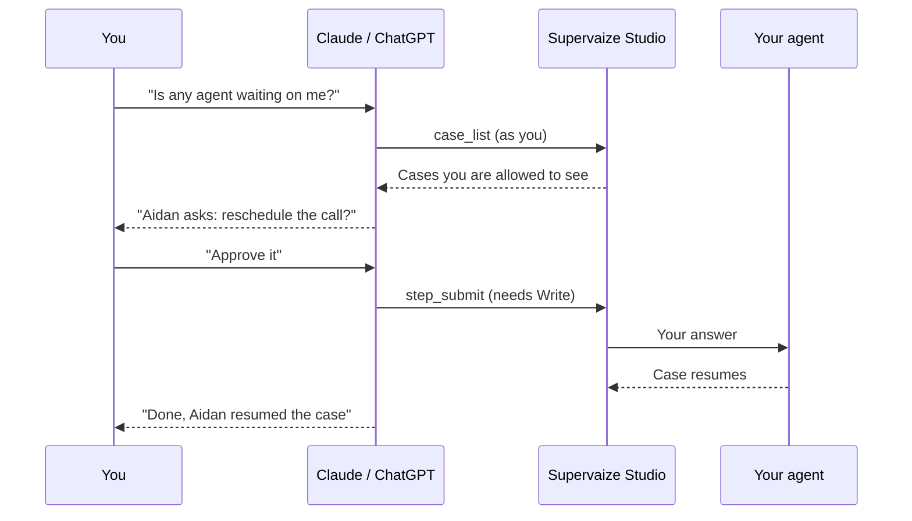

import ChatReplay from "@site/src/components/McpDemo/ChatReplay";

# Supervaize MCP: example usage

Once [the connector is installed](./install), talk to your workspace in plain language. Pick a conversation below and watch which tools the assistant calls.

<ChatReplay />

## Prompts to try

Copy any of these into Claude or ChatGPT.

### See what is going on (read)

- _What is running in my Supervaize workspace?_
- _Which missions have active jobs, and who is assigned to them?_
- _How did the Customer Voice mission do over the last 30 days? Cases by status and total cost._
- _Show me the steps of the last failed case and tell me where it went wrong._
- _Which agents are online?_

### Unblock an agent (write)

- _Is any agent waiting on me?_
- _Show me the question on that case, then approve it._

The assistant reads the pending human-in-the-loop step, shows you the question, and submits **your** answer with `step_submit`. The agent resumes at once.

### Launch work (write)

- _Create a mission called "Q4 Check-ins" and assign Aidan to it._
- _Start a new job for Aidan in the Onboarding Check-ins mission._

Creating a job is always two-phase: the assistant first calls `job_setup` in **preview** mode and shows what it would create. Nothing starts until you confirm.

:::tip Write a weekly report in one prompt
_Every Monday I want a status of all in-progress missions: cases completed last week, cost, and anything awaiting input. Write it as a short email to my team._ The assistant chains `mission_list`, `mission_stats` and `case_list` on its own.
:::

## How a request flows

## Vocabulary

| Term | Meaning |
| --- | --- |
| **Mission** | Groups the work of one or more agents |
| **Job** | One agent run inside a mission |
| **Case** | The agent's unit of work inside a job, for example one interview or one ticket |
| **Step** | One ordered event of a case; some steps wait for a human answer |

## Tool reference

The connector exposes 18 tools. You never call them yourself; the assistant picks them. **Write** tools need the Write permission granted at connection time and the matching role in Studio.

| Tool | What it does | Access |
| --- | --- | --- |
| `workspace_info` | Connected workspace, your roles, granted permissions | Read |
| `agent_list` | Agents in the workspace and their status | Read |
| `catalog` | Data resources and analytics each agent declares | Read |
| `mission_list` / `mission_get` | Browse the missions you can see | Read |
| `mission_stats` | Jobs and cases by status, cost, activity per day | Read |
| `job_list` / `job_get` | Browse jobs, their cases and the agent's actions | Read |
| `case_list` / `case_get` | Browse cases and their ordered steps | Read |
| `resource_list` / `resource_get` | Items of an agent-declared data resource (sensitive fields masked) | Read |
| `artifact_get` | Fetch a deliverable attached to a step | Read |
| `mission_create` | Create a mission, optionally assigning agents | Write |
| `job_setup` | Create a job for an agent: preview, then confirm | Write |
| `step_submit` | Answer a human-in-the-loop step | Write |
| `agent_action_invoke` | Run an action the agent declares on a job | Write |
| `job_sync` | Reconcile a job with its agent after a network hiccup | Write |

## Good to know

- **Sensitive fields stay masked** in data resources unless your role can configure agent parameters.
- **Every call is logged** with the tool name and who made it. Argument values and responses are not stored.
- **Sessions last.** The assistant refreshes its access silently; after 30 days without use you sign in again.
