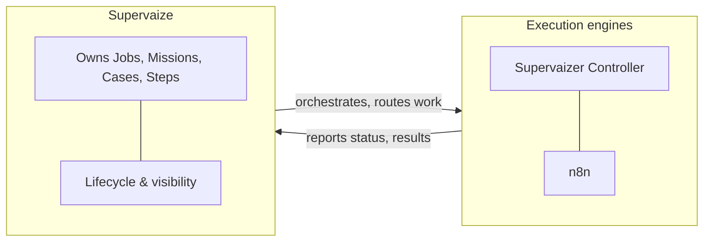
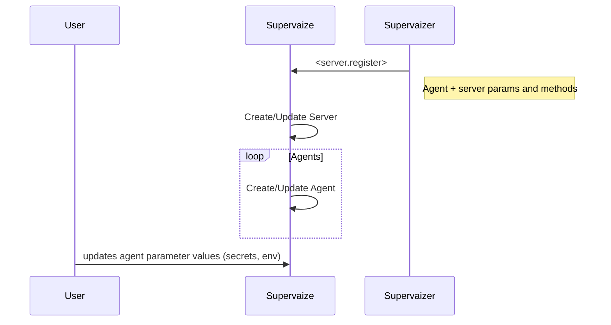
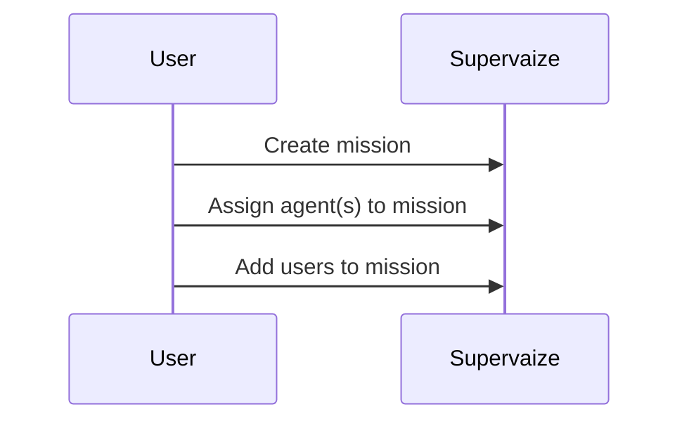
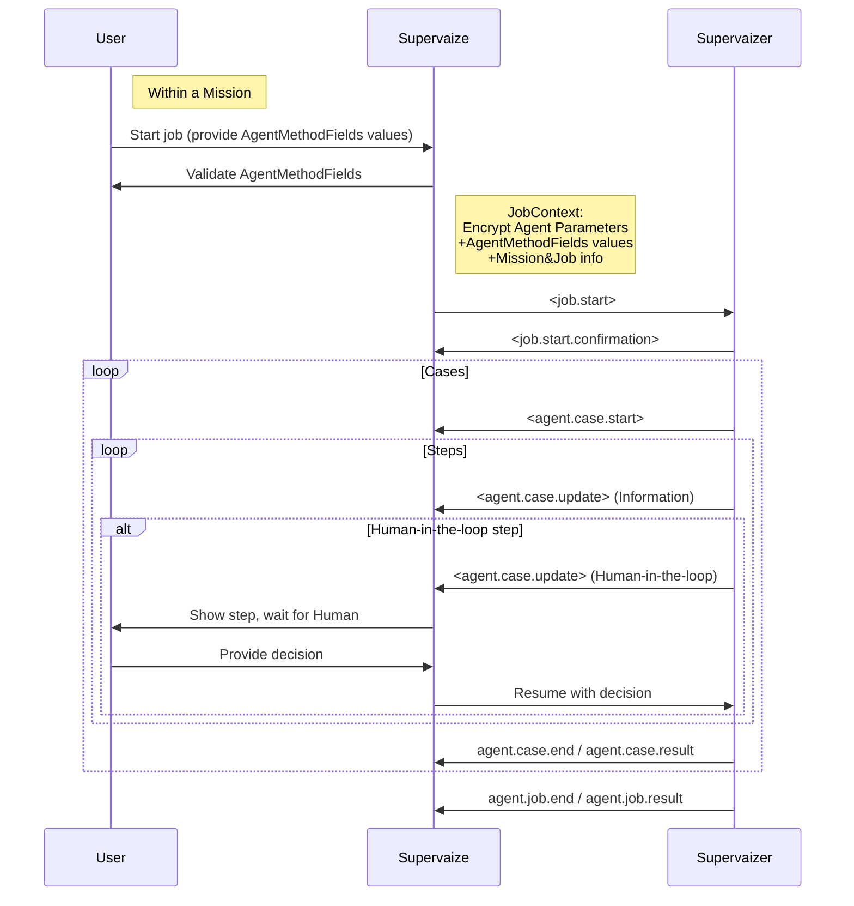

This page clarifies the mental model behind Supervaize and how it relates to execution engines.

## Mental model

- **Supervaize** is the **system of record** for AI-driven work. It owns business-level entities, lifecycle, and visibility.
- **Supervaizer** (or n8n or other engines) is an **execution engine** used to run workflows on behalf of Supervaize.

### Agent registration flow

Supervaizer registers the agent and server with Supervaize; the user then supplies parameter values (secrets, env) in the Supervaize UI.

### Mission setup

### Job execution

User starts a job and supplies field values; Supervaize creates the job context and triggers the agent. The agent creates cases and steps; human-in-the-loop steps pause until the user responds in Supervaize.

## Core Supervaize concepts

### Supervaizer Controller

The **Supervaizer Controller** is the runtime that deploys and exposes your agent to Supervaize. It provides the API, authentication, and registration layer so Supervaize can discover and call your agent.

| Aspect           | Description                                                                                                                |
| ---------------- | -------------------------------------------------------------------------------------------------------------------------- |
| **Role**         | Hosts the agent; exposes endpoints (e.g. job_start, job_stop, job_status) and optional A2A discovery                       |
| **Deployment**   | Deployed by the developer; the agent is reachable at **SUPERVAIZER_PUBLIC_URL** (or equivalent)                            |
| **Registration** | When the controller starts, it **registers the agent and its server** with Supervaize so the platform can route Jobs to it |

### Agent

An **Agent** is a discoverable, executable capability that performs work on behalf of Supervaize. The developer deploys it; it is reachable at **SUPERVAIZER_PUBLIC_URL**. When deployed with the **Supervaizer Controller**, the agent (and its server) register themselves with Supervaize so the platform can invoke the agent's methods.

| Aspect            | Description                                                                                                                            |
| ----------------- | -------------------------------------------------------------------------------------------------------------------------------------- |
| **Role**          | Runs Jobs; assigned to Missions                                                                                                        |
| **Identity**      | Has a unique agent ID; registered with Supervaize (e.g. via the Supervaizer Controller)                                                |
| **Configuration** | Parameters, secrets, and methods (e.g. `job_start`, `job_stop`, `job_status`) are managed in Supervaize                                |
| **Deployment**    | Deployed by the developer; reachable at **SUPERVAIZER_PUBLIC_URL**; with the Controller, registers itself and its server to Supervaize |

### Mission

A **Mission** is an objective or project that groups work and assigns who does it.

| Aspect         | Description                                                                                                                  |
| -------------- | ---------------------------------------------------------------------------------------------------------------------------- |
| **Role**       | Organizes Jobs into a logical, goal-oriented workflow; defines objectives and success criteria                               |
| **Identity**   | Identified by `mission_id`; Jobs are created and run in the context of a Mission                                             |
| **Assignment** | Has team members, stakeholders, and one or more Agents assigned; owns business context (e.g. rating criteria, context rules) |

### Job

A **Job** is created in Supervaize and represents a **business-level unit of work**.

| Aspect        | Description                                             |
| ------------- | ------------------------------------------------------- |
| **Ownership** | Owned and lifecycle-managed by Supervaize               |
| **Identity**  | Identified by `job_id`                                  |
| **Execution** | A Job may have one or more execution attempts over time |

### Case

A **Case** is the **execution run** of a workflow for a given Job.

| Aspect           | Description                                                             |
| ---------------- | ----------------------------------------------------------------------- |
| **Definition**   | One Case = one concrete execution of an n8n workflow                    |
| **Identity**     | `case_id` is equal to the n8n `execution_id`                            |
| **Authority**    | n8n is the authority for Case execution; Supervaize mirrors Case status |
| **Relationship** | A Job may have multiple Cases (retry, re-run, alternative flow)         |

### Step

A **Step** is a meaningful event or action **within** a Case. Steps are emitted by n8n as the workflow progresses and forwarded to Supervaize.

There are two types of Steps:

| Type                        | Description                                                                                                                                                       |
| --------------------------- | ----------------------------------------------------------------------------------------------------------------------------------------------------------------- |
| **Informational Steps**     | Progress updates, execution milestones, intermediate results. Do **not** block execution.                                                                         |
| **Human-in-the-Loop Steps** | Require a human or external decision. **Pause** the Case execution in n8n. Are **resolved in Supervaize**. Resume the Case when the decision is sent back to n8n. |

## Supervaize events

The Supervaizer Controller (and agents) communicate with Supervaize by sending **events**. Event types include:

| Category   | Event                  | Constant                       |
| ---------- | ---------------------- | ------------------------------ |
| **Server** | Server registration    | `server.register`              |
| **Agent**  | Agent anomaly          | `agent.anomaly`                |
| **Job**    | Job start              | `agent.job.start`              |
|            | Job start confirmation | `agent.job.start.confirmation` |
|            | Job end                | `agent.job.end`                |
|            | Job result             | `agent.job.result`             |
|            | Job error              | `agent.job.error`              |
|            | Job timeout            | `agent.job.timeout`            |
| **Case**   | Case start             | `agent.case.start`             |
|            | Case end               | `agent.case.end`               |
|            | Case result            | `agent.case.result`            |
|            | Case update            | `agent.case.update`            |
|            | Case error             | `agent.case.error`             |

Payload details and example responses are available in the supervaizer repo: [mock_api_responses.py](https://github.com/supervaize/supervaizer/blob/main/tests/mock_api_responses.py).

## Summary

- **Supervaizer Controller** → runtime that deploys the agent, exposes its API, and registers the agent and server with Supervaize.
- **Agent** → executable capability that runs Jobs; deployed by the developer (reachable at SUPERVAIZER_PUBLIC_URL); registered and configured in Supervaize.
- **Mission** → objective/project that groups Jobs and assigns Agents and team.
- **Job** → business unit of work (Supervaize); belongs to a Mission, run by an Agent.
- **Case** → one workflow execution for that Job (1:1 with n8n execution; n8n is execution authority).
- **Step** → event/action inside a Case (informational or human-in-the-loop).

For how to create Cases, send Step updates, and handle human input from your agent code, see [Application flow control](application-flow-control).
